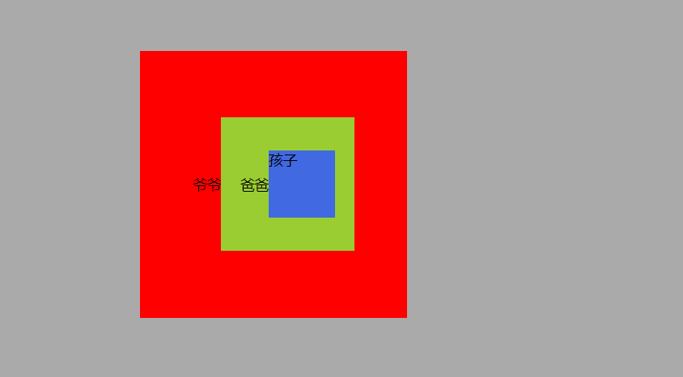
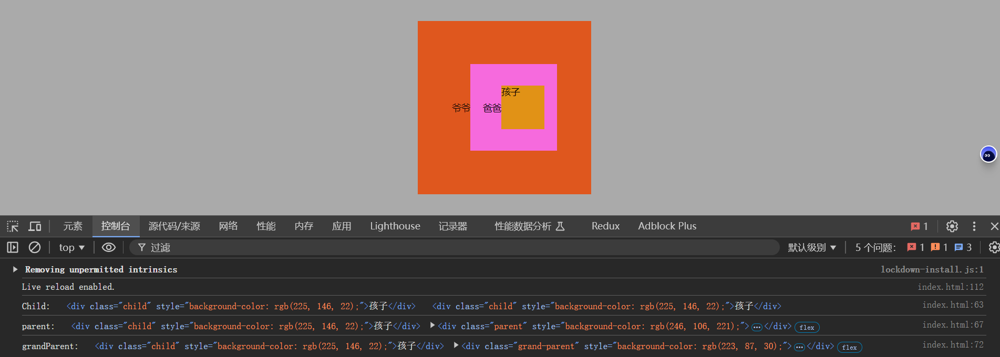
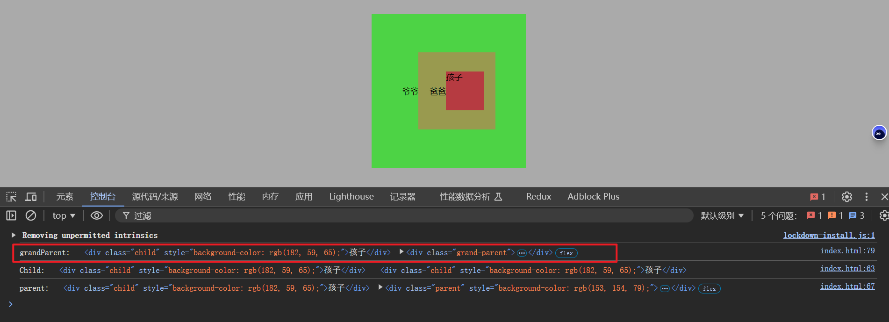

## 捕获

当用户触发事件时，比如点击，按键等等，DOM 会生成一个事件对象，但该事件并不是在目标元素直接生成的，而是在根元素 Document 处生成的，它会沿着 dom 树的层级关系从上向下传播到目标元素触发事件处理，该过程称为捕获。

## 冒泡

在目标元素处触发事件后，事件传播并未停止，它会沿着来时的路径在返回到根元素 Document，在返回过程中如果途径的元素上绑定了同一事件类型的处理程序，则也会触发。该过程成为冒泡。

## 例子



在三个元素上分别绑定了点击事件，只要触发事件就会改变背景颜色。（图中所示三种颜色是默认颜色）

当你点击孩子元素时，会发现不仅改变了孩子元素的背景色，其父元素和“爷元素”也都改变了背景色。我们来分析一下这个现象背后的过程，当点击孩子元素时，在 Document 生成了点击事件，通过捕获过程穿过爷元素和父元素到达子元素触发改变背景色的事件处理程序，之后该点击事件通过冒泡过程穿过父元素和爷元素并在经过时触发其身上绑定的 click 事件处理程序 ，因而他们的背景色也改变了。

## e.target() 和 e.currentTarget()

```jschild.addEventListener("click", function (e) {
child.addEventListener("click", function (e) {
        this.style.backgroundColor = randomColor();
        console.log("Child:", e.target, e.currentTarget);
      });

```

`e.target` 是**事件的实际触发元素**，即用户点击、悬停等交互操作发生的具体元素。

无论事件是绑定在该元素本身，还是通过事件冒泡从其父元素触发，`e.target`始终表示最底层、最具体的触发元素。

`e.currentTarget` 是**事件处理程序绑定的元素**，即当前处理事件的那个元素。

它表示的是正在处理该事件的元素，而非实际触发事件的元素。当事件冒泡时，`e.currentTarget`会随着事件冒泡改变，指向绑定事件处理函数的元素。



## 设置在捕获阶段触发事件

在默认情况下，事件触发是在冒泡阶段，但我们可以在`addEventListener`添加第三个参数，设置为在捕获阶段触发事件

````js//设置在捕获阶段触发事件
      grandParent.addEventListener(
        "click",
        function (e) {
          this.style.backgroundColor = randomColor();
          console.log("grandParent:", e.target, e.currentTarget);
        },
        true
      );```
````



先触发爷元素上绑定事件
